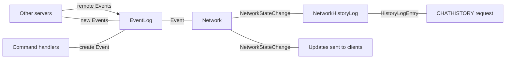

# State, Events, History, and Things In Between

The representation of network state, and changes to it, can be non-intuitive, but mostly has good
reasons for it. In particular, changes to the state of the network are represented in several
different forms at various stages of processing. This document attempts to explain how and why these
things are done.

## Network State

The state of the entire network at a given point in time is contained in the `Network` type. This
struct is read-only for the vast majority of operations, and can only be updated by emitting an
event which will be propagated, processed and applied.

The `Network` contains plain-old-data structures representing all objects in the shared network
state. Each object has an ID, and each object that needs to refer to another does so by ID. This
ensures that network state can be serialised and transmitted between server nodes as required, and
also avoids any problems of self-referential data structures, which Rust discourages.

Most access to the objects within the network is done via ephemeral wrapper objects, which provide
convenient accessor methods to retrieve related objects as their equivalent wrappers.

## Events and the Event Log

An `Event` represents a thing which happened on the network and which results in one or more changes
to the network state. Events are most often, but not exclusively, emitted by command handlers.

Because events are being constantly emitted by all servers on the network at all times, they do not
have a total ordering. Instead, each event contains an `EventClock` describing the most recent set
of events which had been processed by the server that emitted it. These clocks provide dependency
information - every event depends on all events which were processed before it was created, and so
all of those events must be processed by a receiving server before the event which depends upon
them.

The `EventLog` maintains this dependency information, and provides two main functions:
 * When the server emits a new event, encoding the correct dependency information and propagating it
   to the rest of the network.
 * For every new event emitted or received from the network, ensuring that all its dependencies are
   met and providing a linear stream of events in an order consistent with their dependency
   information.

Note that the order of this event stream will not be the same for different servers on the network, but all observed orders will be consistent with the stated dependency data.

## Eventual Consistency

Sable's design is that the network state is eventually consistent. Because the event stream will be
seen in different orders by different servers, they may go through different intermediate states in
order to arrive at the same final state.

As a result, `Event`s cannot be used to describe granular changes to network state, because the
changes that they cause will depend upon what else has previously been processed.

A simple example of this is two users ('foo' and 'bar'), connected to different servers, who attempt
to change to the same nickname ('baz') at the same time. Because of the eventual consistency rule,
all servers will see the same state after processing both events, but the set of visible changes to
state will differ depending on which event is processed first.

Supposing that 'foo' wins the tie breaker, then the end result will be that foo's nick is now baz,
and bar's nick is a unique numeric string used to resolve the collision. Either of the following
sets of changes are valid to reach this point:

If foo's event is processed first:
 1. foo changes nick to baz
 2. bar changes nick to 123456789

If bar's event is processed first:
 1. bar changes nick to baz
 2. baz changes nick to 123456789
 3. foo changes nick to baz

## State Updates

Since an `Event` alone cannot describe the changes that were made to network state in order to
process it, a second type exists to do that - `NetworkStateChange`. Zero or more of these are
emitted by the `Network` when processing a single `Event`, and they can be processed by node types
to do things like notify clients that a state change has occurred.

The `NetworkStateChange` is also the core of the local, in-memory, history log maintained by each
node.

## History

There are two distinct history stores in Sable. First, every node maintains a time-limited history
of the entire network; second, there are specialist history servers which store long-term history
for channels which have opted in to it.

### Local History

The in-memory history log is comprised of two parts.
 * A running log of all the `NetworkStateChange`s that have been seen by this server, wrapped in
   `HistoryLogEntry` objects. The `HistoryLogEntry` attaches a local ID for lookup, and a small
   amount of metadata used mostly for attaching message tags.
 * A per-user log of the entry IDs which that user is permitted to see, referencing the main log of
   history entries.

This allows a server to faithfully replay recent history to any user, in exactly the form that that
user would have originally seen it and containing all channel and private messages that that user
would have received.

### Remote History

A specialised history server stores longer-term history specifically for channels that have opted in
to it. This is done in a SQL database, for persistent storage. Client servers handling a history
request that goes beyond what they have in memory can make a remote request, over the sync network,
to the history server to retrieve additional message history.

The format is necessarily different from the in-memory history log. Those `NetworkStateChange`
objects refer to things like message content via an object ID to be looked up in network state,
which is not possible when retrieving messages older than the network's retention time.

## End to End

